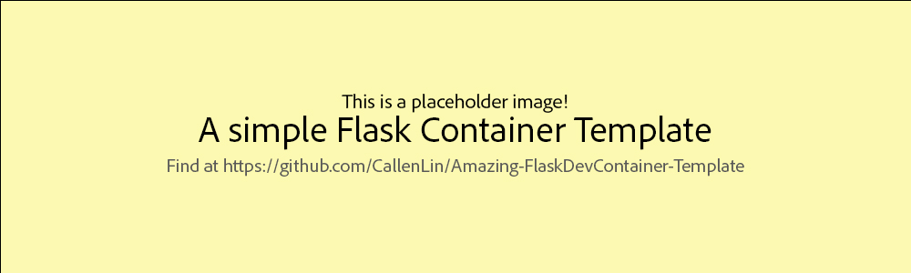

<h1 align="center">
  Example Flask Container Name!
</h1>

<p align="center">
  
</p>

<p align="center">
  <b>A short decription</b>
</p>

<hr>

## Description
A description of what the project does.

<hr>

## Quick Start
List a short description of what this does and the commands needed to run.
```
code blocks for commands
```

<hr>

## Help
**List common issues that may occur**

<hr>

## License
This project is licensed under the [NAME HERE] License - see the LICENSE.md file for details
